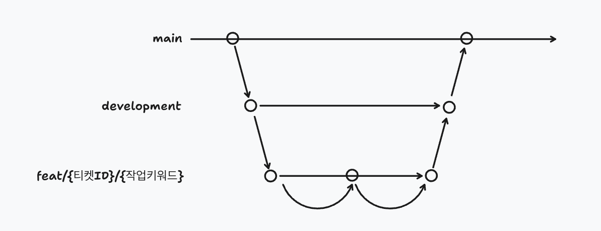

# 이즐리 랜딩페이지 프로젝트

Next.js 기반 이즐리 랜딩페이지 프로젝트입니다.

## 브랜치 규칙



`main`: 상용환경에 배포가 이루어질 브랜치입니다.

`development`: 개발작업들이 merge될 브랜치입니다.

`feat/{ticket-id}/{description}`: 작업이 이루어질 브랜치입니다.

- 작업 가이드

  - `development` 브랜치로부터 `feat/{ticket-id}/{description}` 브랜치를 생성하여 작업을 commit합니다.
  - 작업이 끝나면 `feat/{ticket-id}/{description}`에서 `development`을 base로 PR을 생성합니다.
  - 리뷰가 끝나면 PR을 머지합니다.

- 배포 가이드
  - `development`에서 `main`을 base로 PR을 생성합니다.
  - PR을 머지하여 배포를 진행합니다.

## PR 작성 규칙

- PR의 제목을 `[티켓ID] {작업 내용}`와 같은 형식으로 작성합니다.
- 위와 같은 형식으로 작성하면, 대응하는 티켓의 상태가 자동으로 업데이트됩니다.
  - PR 생성: 티켓 상태가 `리뷰 중`으로 업데이트됩니다.
  - PR 머지: 티켓 상태가 `완료`로 업데이트됩니다.

## 커밋 규칙

- 커밋 메시지는 한글로 작성합니다.
- 작업 사항에 따라 prefix를 붙여서 작성합니다.

### 접두사 종류

- [`feat`] : 일반적으로 디자인 작업을 포함한 코드 작업을 수행할때 사용합니다. (e.g. `feat: TodoListItem 컴포넌트 추가` )
- [`fix`] : 의도치 않은 문제를 해결하고자 하는 커밋일때 사용합니다. (e.g. `fix: 할일 추가가 되지 않는 문제 수정` )
- [`docs`] : 문서화작업을 할때 사용합니다. (e.g. `docs: 커밋 규칙 문서 추가` )
- [`refactor`] : 기존의 코드를 개선하고자 하는 작업을 할때 사용합니다. (e.g. `refactor: 컴포넌트 이름 변경` )
- [`config`] : 프로젝트 또는 프레임워크에 대한 설정 작업을 할때 사용합니다. (e.g. `config: tailwind theme 설정 추가` )

## 프로젝트 구조

```bash
EasilyProject/
src/
├── app/
│ ├── features/ # 기능별 모듈 디렉토리
│ │ ├── auth/ # 인증 기능 (로그인, 회원가입 등)
│ │ │ ├── components/ # 인증 관련 컴포넌트
│ │ │ ├── api/ # 인증 관련 api
│ │ │ └── pages/ # 인증 관련 페이지
│ │ │
│ │ ├── posts/ # 게시판
│ │ │ ├── components/ # 게시판 관련 컴포넌트
│ │ │ ├── api/ # 게시판 관련 api
│ │ │ └── pages/ # 게시판 관련 페이지
│ │ │
│ | ├── easilyMain/ # app 라우팅
│ │ │ ├── page.js # features 내부의 pages와 연결
│ │ │ └── layout.js
│ │ └──
│ ├── components/ # 전역에서 사용되는 재사용 가능한 컴포넌트
│ │  └── layout.js
│ ├── api/ # 전역에서 사용되는 api
│ ├── store/ # 전역 상태 관리 (예: Context API, Redux, recoil, zustand 등)
│ └──styles/ # 전역 스타일
└── lib/ # 사용되는 라이브러리리
```

## 작업시 유의 사항

- 우선은 next.js 환경의 작업 난이도를 낮추기위해, 모든 새로운 페이지 파일의 최상단에는 'use client'를 붙여서 작성해주세요. 참고: [use client](https://nextjs.org/docs/app/api-reference/directives/use-client)
